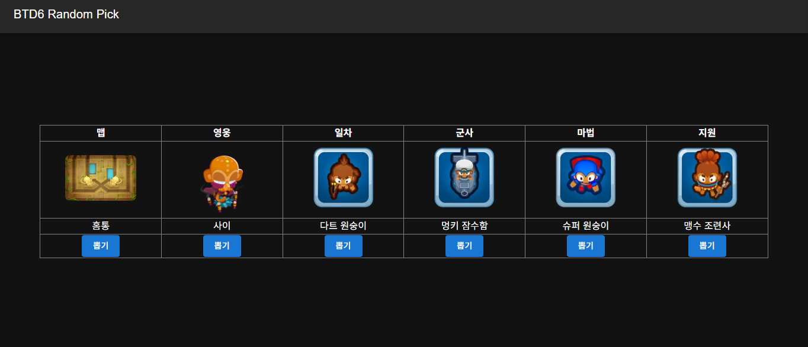

# 블룬스 타워 디펜스 6 랜덤 조합기 사용 설명서

이 페이지는 **블룬스 타워 디펜스 6**에서 **맵, 영웅, 타워(일차/군사/마법/지원)** 을 무작위로 선택해 조합을 만들어주는 도구입니다. 새로운 전략을 시도하거나, 도전 과제를 만들 때 유용하게 사용할 수 있습니다.

---

## 🧩 기능 소개

| 항목          | 설명                             |
| ------------- | -------------------------------- |
| **맵**        | 플레이할 무작위 맵을 선정합니다. |
| **영웅**      | 사용할 무작위 영웅을 선정합니다. |
| **일차 타워** | 일차 타워를 무작위로 선택합니다. |
| **군사 타워** | 군사 타워를 무작위로 선택합니다. |
| **마법 타워** | 마법 타워를 무작위로 선택합니다. |
| **지원 타워** | 지원 타워를 무작위로 선택합니다. |

---

## 🎮 사용 방법

1. 각 항목 아래에 있는 **[뽑기]** 버튼을 클릭합니다.
2. 선택된 맵, 영웅, 타워의 이미지와 이름이 화면에 표시됩니다.
3. 표시된 조합을 기준으로 게임을 플레이해 보세요.
   - 선택된 타워 외에는 사용하지 않는 자체 룰을 적용하면 더욱 재미있습니다.

---

## 📷 예시 화면

---

## 🔁 뽑기 및 재뽑기

- 각 항목의 **[뽑기]** 버튼을 클릭하면 무작위로 하나가 선택되어 표시됩니다.
- 같은 버튼을 다시 눌러도 새로운 항목이 무작위로 선택됩니다.
- 즉, 언제든지 원하는 항목만 따로 다시 뽑을 수 있습니다.

---

## 💡 팁

- 랜덤 조합으로 **노빵꾸**, **CHIMPS** 모드에 도전해 보세요.
- 친구들과 같은 조합을 맞춰 경쟁 플레이를 즐겨보는 것도 재미있습니다.
- 타워 업그레이드 경로를 제한해 난이도를 조절하는 것도 추천드립니다.

---

## 📱 지원 환경

- 데스크톱 브라우저 (Chrome, Firefox, Edge 등)
- 모바일 브라우저 (가로 화면 권장)

---

이 랜덤 조합기는 **블룬스 타워 디펜스 6**를 더 창의적이고 색다르게 즐길 수 있도록 도와줍니다. 다양한 조합을 실험해보며 자신만의 전략을 만들어 보세요!
